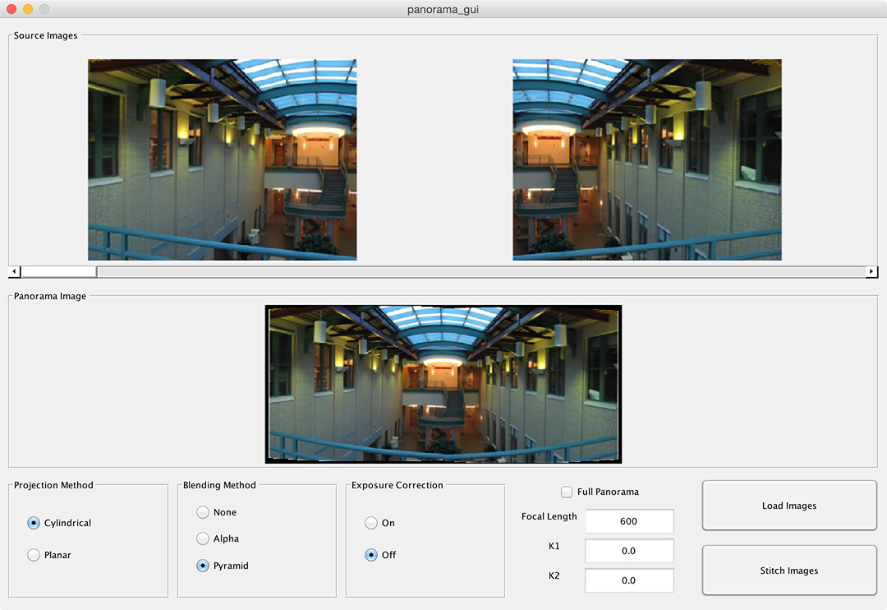
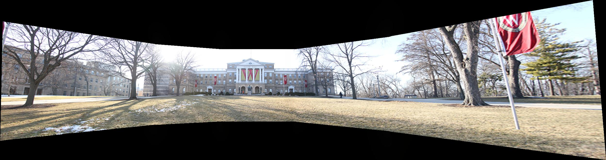
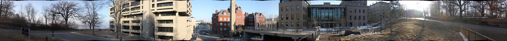

# CS 766 Panorama Project

## Group Members
Ke Ma, Christopher Bodden

## Assignment Description
Image stitching is a technique to combine a set of images into a larger image by registering, warping, resampling and blending them together. A popular application of image stitching is to create panoramas. Generally speaking, there are two classes of methods for image stitching: direct methods and feature-based methods. In this project we implement a feature-based method using SIFT features.

## Features
This is a brief description of our implementation. More details can be found in the other pages of the wiki.

### Basic Features

* Cylindrical warping
* Image alignment with SIFT and RANSAC
* Image stitching with alpha blending
* Cylindrical panorama creation with end-to-end alignment
* Interactive panorama viewer

### "Bonus" Features

* Lens distortion correction
* Planar panorama creation via homography
* Exposure correction
* Pyramid blending
* "Photo to Document"

### Features Attempted But Not Fully Functional

* Graph Cut Blending - There were issues with the minimum cut algorithm as well as concerns about practicality (the runtime was extremely long to cut the graph even for small images).

## Program Screenshot

## Image to be Vote

### Bascom Hill Panorama (Planar)

View the [high-resolution interactive version](InteractiveViewer/Bascom2.html)

### Bascom Hill Panorama (Cylindrical)

View the [high-resolution interactive version](InteractiveViewer/Bascom1.html)