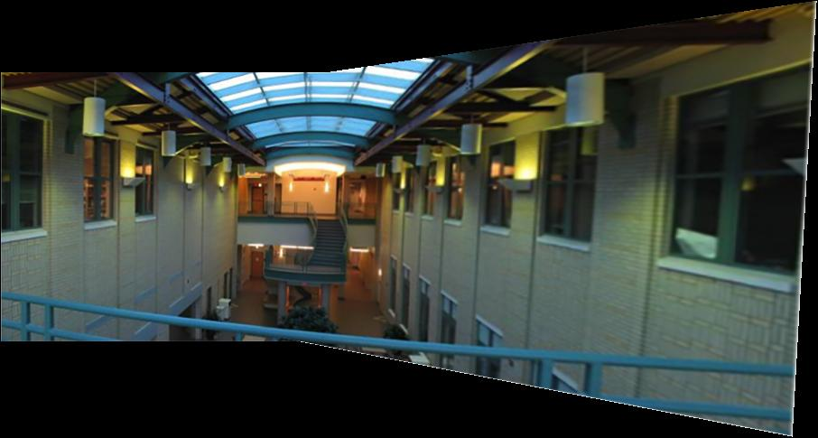
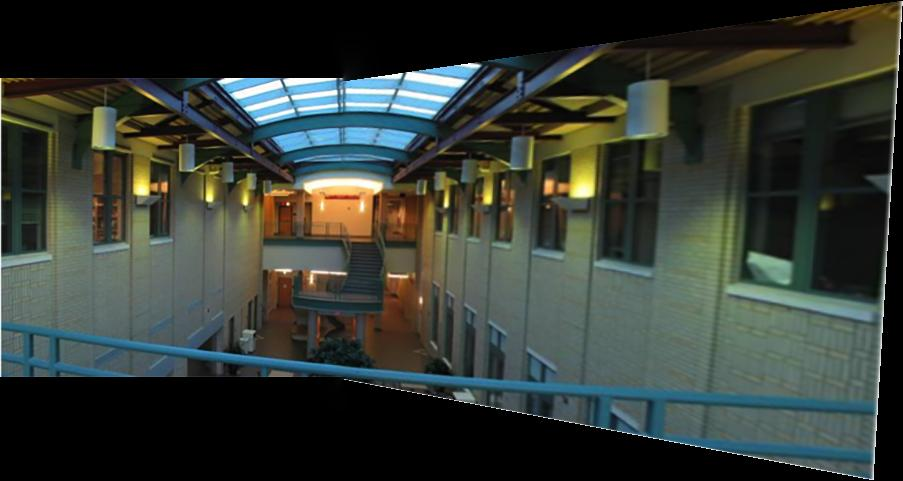
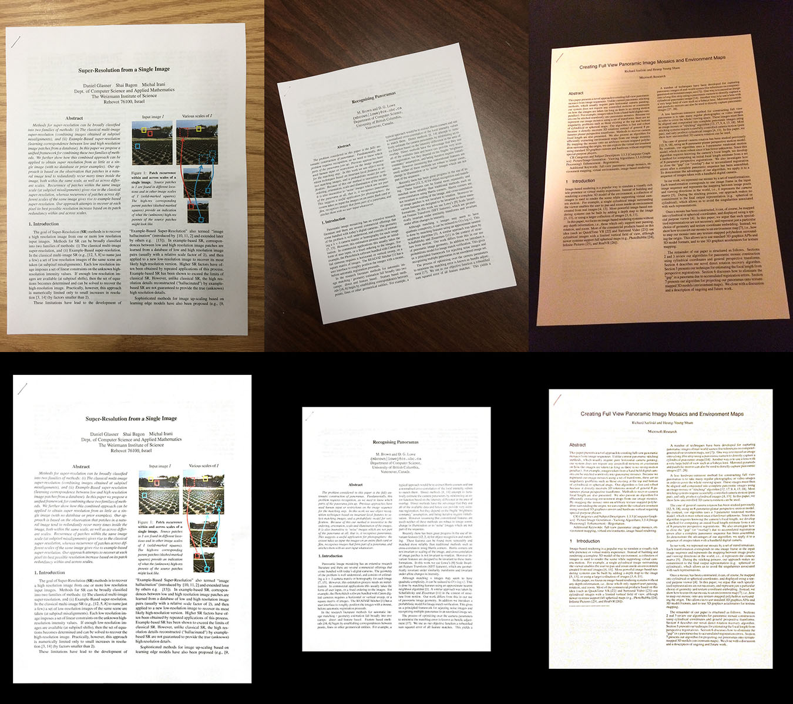

% CS 766 - Panorama Project Documentation
% Ke Ma; Christopher Bodden
% 3/16/2015

# Project Overview

## Links
* Repository: <https://github.com/cbod/cs766-panarama>
* Wiki: <https://github.com/cbod/cs766-panarama/wiki>

## Assignment Description

Image stitching is a technique to combine a set of images into a larger image by registering, warping, resampling and blending them together. A popular application of image stitching is to create panoramas. Generally speaking, there are two classes of methods for image stitching: direct methods and feature-based methods. In this project we implement a feature-based method using SIFT features.

## Features

This is a brief description of our implementation. More details can be found in the other pages of the wiki.

### Basic Features

* Cylindrical warping
* Image alignment with SIFT and RANSAC
* Image stitching with alpha blending
* Cylindrical panorama creation with end-to-end alignment
* Interactive panorama viewer

### "Bonus" Features

* Lens distortion correction
* Planar panorama creation via homography
* Exposure correction
* Pyramid blending
* "Photo to Document"

### Features Attempted But Not Fully Functional

* Graph Cut Blending - There were issues with the minimum cut algorithm as well as concerns about practicality (the runtime was extremely long to cut the graph even for small images).

## Program Screenshot


## Image to be Vote: *Bascom Hill*

### Bascom Hill Panorama (Planar)


View the [high-resolution interactive version](InteractiveViewer/Bascom2.html)

### Bascom Hill Panorama (Cylindrical)


View the [high-resolution interactive version](InteractiveViewer/Bascom1.html)

# Results

We developed methods to create two types of panorama images: planar panorama and cylindrical panorama. To be specific, we implemented the following algorithms:

* SIFT feature description and matching ([](http://www.vlfeat.org/))
* RANSAC
* Homography and translation solver
* Cylindrical warping with lens distortion correction
* End-to-end alignment for full panoramas
* Exposure correction
* Alpha blending
* Pyramid blending

## Planar Panorama

Planar panorama is created by transforming source images into the coordinate system of a reference image via homography transformations.

### Original Planar Panorama


Because no blending is applied, there is an obvious seam between the stitched images.

### Planar Panorama w/ Alpha Blending



Alpha blending mitigates the seam, but introduces some ghosting effects due to the minor misalignments.

### Planar Panorama w/ Pyramid Blending



Pyramid blending solves both the seam and the ghosting problems (although there are still some ghosting effects near the center line of the overlapping region).

## Cylindrical Panorama

Cylindrical panorama is created by first warping source images into the cylindrical coordinate system and then aligning them via translations. The advantage is the ability to create 360-degree full panoramas.

### Original Cylindrical Panorama


It's common that the source images have some exposure differences, which is problematic in creating panoramas. What's more, the drift problem caused by accumulated errors makes the both ends of the panorama not align well.

### Cylindrical Panorama w/ End-to-end Alignment


End-to-end alignment solves the drift problem, which enables the creation of perfect 360-degree full panoramas.

### Cylindrical Panorama w/ Exposure Correction


Gamma correction can be employed to take care of the exposure differences. The overlapping regions provide enough information to estimate the gamma values.

### Cylindrical Panorama w/ Alpha Blending


Alpha blending introduces transitions across image pieces, and makes the exposure differences less obvious.

### Cylindrical Panorama w/ Pyramid Blending


Pyramid blending blurs the seams between image pieces.

## Image to be Vote: *Bascom Hill*

We took two sets of photos at Bascom Hill on Mar 10, 2015, one of which was used to create a planar panorama and the other was for cylindrical panorama.

### Bascom Hill Panorama (Planar)


View the [high-resolution interactive version](InteractiveViewer/Bascom2.html)

### Bascom Hill Panorama (Cylindrical)


View the [high-resolution interactive version](InteractiveViewer/Bascom1.html)

### Camera Calibration

We took the photos with Canon EOS 7D Camera and Canon EF 28-135mm f/3.5-5.6 IS USM Lens. In order to estimate the focal length and the lens distortion parameters, we performed a camera calibration process with [Camera Calibration Toolbox for Matlab](http://www.vision.caltech.edu/bouguetj/calib_doc/).


We took 38 photos of a checkerboard with various poses to calibrate our camera. In order to be consistent with the lens distortion model we implemented, we simplified the parameter estimation model as well.

```
Focal Length:          fc = [ 6624.01573   6624.01573 ] ± [ 21.61046   21.61046 ]
Principal point:       cc = [ 2591.50000   1727.50000 ] ± [ 0.00000   0.00000 ]
Skew:             alpha_c = [ 0.00000 ] ± [ 0.00000  ]   => angle of pixel axes = 90.00000 ± 0.00000 degrees
Distortion:            kc = [ -0.15801   0.06858   0.00000   0.00000  0.00000 ] ± [ 0.02783   0.32350   0.00000   0.00000  0.00000 ]
Pixel error:          err = [ 2.43803   1.33927 ]
```

## Another Extension: *Photo to Document*

Another application of homography transformation is to rectify images. We adopted this and developed a method to covert photos that contains pages to clean document images. This is achieved by automatically detecting the corners, rectifying the image and enhancing it.



# Using the GUI
We implemented an interactive GUI to streamline the process of using our functions to build panoramas. Users can upload images and stitch them using a variety of options. The basic process is:

1. Open 'panorama_gui.m' in MATLAB and Run the file
2. Load the images to stitch
3. Select the construction method
4. Select the blending method
5. Select whether to use exposure correction
6. Configure options for cylindrical construction (only if using cylindrical)


## Loading Images
Loading the images is simple. Click 'Load Images' and select all of the images to stitch.

## Selecting Construction Method
We provide 2 methods of stitching images:

* Cylindrical: Projects each image into cylindrical coordinates and solves for translations between images to combine them.
* Homography: Solves for the homographies between images to combine them. This is most appropriate for images that do not wrap around 360 degress.

## Selecting Blending Method
This group sets the blending options for the stitching:

* None: No blending will be performed.
* Alpha: This method uses an alpha mask for the image to weight the edges.
* Pyramid: This method uses a pyramid of Laplacians to seamlessly merge the images.

## Exposure Correction
If 'On' is selected, the images will be corrected to have the same exposure value using gamma correction. Selecting 'Off' will perform no exposure changes to the image.

## Cylindrical Construction Options
These options are only used if using the cylindrical construction method. **All fields are required!**

* Full Loop: Check this box if the images form a 360 degree loop.
* focal len: The focal length of the camera for this image scale in pixels.
* k1, k2: Radial distortion parameters for the camera lens.

## Stitching
After all options are set, click 'Stitch Images'. This button is not enabled until images are loaded.

## Saving & Enlarging Images
All photos in the program can be clicked to enlarge and saved via the enlarged image window's file menu.

# Function Descriptions
Below provide basic descriptions of our functions.

## panorama_gui.m
`function varargout = panorama_gui(varargin)`
This is the main program file to launch the GUI. Please run this file in MATLAB to use our program.

## loadImages.m
`function imgs = loadImages(imgFiles)`
Simple function to load a list of images

Inputs:

* imgFiles: a vector of image filenames to load (1D cell array)

Outputs:

* imgs: the loaded color images (4D array, height x width x color x imageIndex)

## compError.m
`function [SSR] = compError(datapoint, transform)`
Function to compute sum of squared errors

Input:

* datapoint - 1 x n x 2 matrix containing the points to compare (1 x n vectors) 
* transform - the nxn transform to apply to pprime

Output:

* SSR - calculation of sum of squared errors

## createPanoramaCyl.m
`function [ newImg ] = createPanoramaCyl( imgs, f, k1, k2, loop, matchExp, blend )`
Create panorama image using cylindrical projection

Input:

* imgs - source images
* f - local length
* k1, k2 - radial distortion parameters
* loop - is is a full panorama?
* matchExp - match exposures across images?
* blend - use which blending technique? 'Alpha' or 'Pyramid'

Output:

* newImg - panorama image

## createPanoramaPla.m
`function [ newImg ] = createPanoramaPla( imgs, matchExp, blend )`
Create panorama image using homography

Input:

* imgs - source images
* matchExp - match exposures across images?
* blend - use which blending technique? 'Alpha' or 'Pyramid'

Output:

* newImg - panorama image

## cylProj.m
`function [ cylImg ] = cylProj( img, f, k1, k2 )`
Warp image into cylindrical coordinates and correct radial distortion

Input:

* img - source image
* f - focal length
* k1, k2 - radial distortion parameters

Output:

* cylImg - cylindrical warpped images

## estimateHomographies.m
`function [ homographies ] = estimateHomographies( imgs )`
Estimate pairwise homographies

Input:

* imgs - source images

Output:

* homographies - homographies matrices to align each pair of images

## solveTranslation.m
`function [ T ] = solveTranslation( cp1, cp2 )`
Compute translation matrix

Input:

* cp1 - correspondence points in image1, n x 2 matrix
* cp2 - correspondence points in image2, n x 2 matrix

Output:

* H - translation matrix that transforms points in image2 to points in image1, 3 x 3 matrix if overdetermined, solve in the least-sqaure sense

## solveHomography.m
`function [ H ] = solveHomography( cp1, cp2 )`
Compute homography matrix

Input:

* cp1 - correspondence points in image1, n x 2 matrix
* cp2 - correspondence points in image2, n x 2 matrix

Output:

* H - homography matrix that transforms points in image2 to points in image1, 3 x 3 matrix if overdetermined, solve in the least-sqaure sense

## RANSAC.m
`function [bestSetting] = RANSAC(P, p, n, data, epsilon, settingFunctionHandle, SSDFunctionHandle)`
RANSAC function for feature matching. Computes the best setting of parameters.

Input:

* P - probability of having at least 1 success (0.99 is a good setting)
* p - probability of a real inlier (can be pesimistic, try 0.5)
* n - number of samples each run
* data - the data points of interest
* epsilon - threshold for inlier
* settingFunctionHandle - handle to function to compute parameter values (homography, translation, etc.)
* SSDFunctionHanle - handle to function to compute the error measure

Output:

* H - homography matrix that transforms points in image2 to points in image1, 3 x 3 matrix

## photo2Doc.m
`function [ newImg ] = photo2Doc( img )`
Align an image as a document (uses homography to transform it into a rectangle)

Input:

* img - source image to align

Output:

* newImg - the image aligned as a document

## mergePyramid.m
`function [ finalImg ] = mergePyramid( imgs, transforms, newHeight )`
Merge images using Pyramid blending

Input:

* imgs - source images
* transforms - transformation matrices to transform each images into the new coordinate system
* newHeight - height of the new coordinate system

Output:

* finalImg - merged image

## mergeNoBlend.m
`function [ newImg ] = mergeNoBlend( imgs, mask, transforms, newHeight, newWidth )`
Merge images with no blending

Input:

* imgs - source images
* mask - image mask
* transforms - transformation matrices to transform each images into the new coordinate system
* newHeight, newWidth - size of the new coordinate system

Output:

*newImg - merged image

## mergeAlpha.m
`function [ newImg ] = mergeAlpha( imgs, mask, transforms, newHeight, newWidth )`
Merge images using Alpha blending

Input:

* imgs - source images
* mask - image mask
* transforms - transformation matrices to transform each images into the new coordinate system
* newHeight, newWidth - size of the new coordinate system

Output:

* newImg - merged image

## matchExposures.m
`function [ newImgs ] = matchExposures( imgs, transforms, loop )`
Match exposures across images

Input:

* imgs - source images
* transforms - pairwise transformation matrices
* loop - is is a full panorama?

Output:

* newImgs - exposure matched images

## getSIFTFeatures.m
`function [f, d] = getSIFTFeatures(image, edgeThresh)`
Function returns feature locations and SIFT descriptors for an image. Uses the VLFeat library.

Input:

* image - an rgb or greyscale image matrix
* edgeThresh - non-edge selection threshold (default should be 10)

Output:

* potential_matches - 3 x n x 2 matrix of [x y z=1] positions for n potential feature matches in images 1 and 2
* scores - the score for each of the n matches in a vector

## getPotentialMatches.m
`function [potential_matches, scores] = getPotentialMatches(f1, d1, f2, d2)`
Function to return potential feature matches between two images. Uses the VLFeat library.

Input:

* f1, f2 - vector of SIFT feature locations and scales for images 1 and 2
* d1, d2 - vector of SIFT feature descriptors that correspond
* with f1, f2

Output:

* potential_matches - 3 x n x 2 matrix of [x y z=1] positions for n potential feature matches in images 1 and 2
* scores - the score for each of the n matches in a vector

## estimateTranslations.m
`function [ translations ] = estimateTranslations( imgs )`
Estimate pairwise translations

Input:

* imgs - source images

Output:

* translations - translation matrices to align each pair of images

# Other Files
Some other files that are not meant to be used functionally, but are either needed for the GUI or were used for testing.

## _enlargeImage.m_
This is a callback that is attached to images in the GUI to enlarge them when clicked.

## _panorama_gui.fig_
This is the GUI window template.

## _TestScripts\\createPanoramaCyl_test.m_
A test script to evaluate functions to create panoramas using the cylindrical projection method.

## _TestScripts\\createPanoramaPla_test.m_
A test script to evaluate functions to create panoramas using the homography method.

## _TestScripts\\cylProj_test.m_
A test script to evaluate the cylindrical projection method.

## _TestScripts\\photo2Doc_test.m_
A test script to evaluate functions for aligning an  image as a document

## _TestScripts\\RANSAC_test.m_
A test script to evaluate our RANSAC method.

# Credits

Below is a break-down of the work description. We worked together on taking the images, editing the project wiki and also helped fix some of each other's bugs!

## Ke Ma

* Homography and translation solver
* Cylindrical warping with lens distortion correction
* Panorama creation pipeline
* Exposure correction
* Alpha blending
* Interactive panorama viewer ([Panorama Viewer](https://github.com/peachananr/panorama_viewer/))
* "Photo to Document"

## Christopher Bodden

* SIFT feature description and matching ([VLFeat](http://www.vlfeat.org/))
* RANSAC
* Pyramid blending
* Graph cut blending _(not completed due to min cut issues)_
* Transform and crop for image pairs
* GUI

# References

1. Lowe, D. G. (1999). Object recognition from local scale-invariant features. In Computer vision.
2. Fischler, M. A., & Bolles, R. C. (1981). Random sample consensus: a paradigm for model fitting with applications to image analysis and automated cartography.
3. Szeliski, R., & Shum, H. Y. (1997). Creating full view panoramic image mosaics and environment maps.
4. Brown, M., & Lowe, D. G. (2003). Recognising panoramas.
5. Zhang, Z. (2000). A flexible new technique for camera calibration.
6. Burt, P. J., & Adelson, E. H. (1983). A multiresolution spline with application to image mosaics.
7. Kwatra, V., Schodl, A., Essa, I., Turk, G., & Bobick, A. (2003). Graphcut Textures: Image and Video Synthesis Using Graph Cuts.